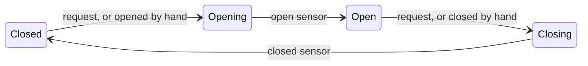
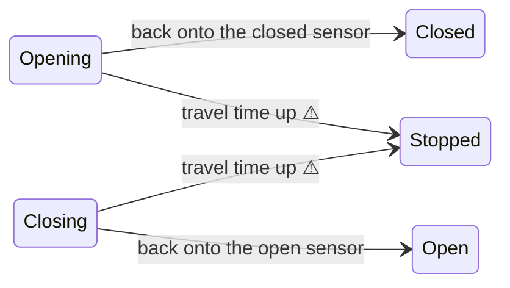
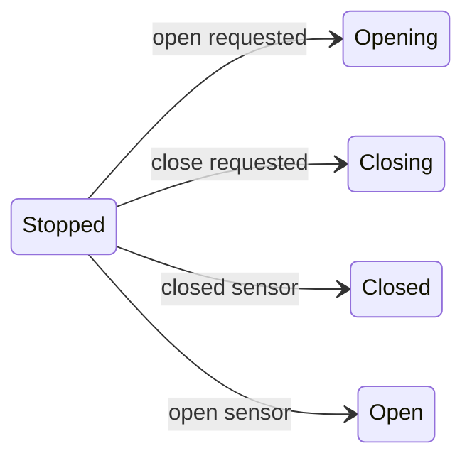
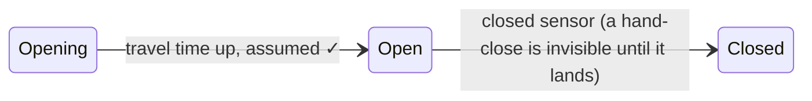
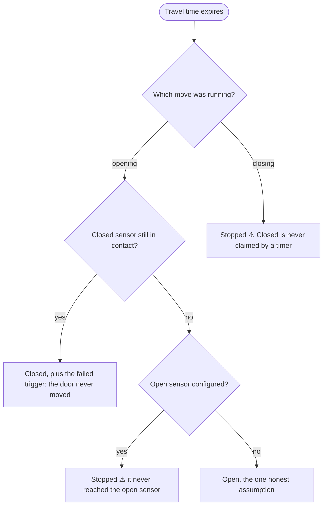

# How the door state is decided (Managed mode)

This is the deep dive for people who want the exact mechanics. For setting up a door, the [README](../README.md) is all you need.

The rule everything follows: **the endpoints are facts, everything in between is reasoning.** A sensor in contact pins the state, whoever moved the door. Between the endpoints, the state comes from the last known direction (which sensor released, or what you requested) plus the travel-time watchdog. With one sensor, *Open* is partly an assumption; with two, *Open* is a measurement, and uncertainty is reported as **Stopped** instead of assumed away.

## Every sensor situation, side by side

| What the sensors say | With only a closed sensor | With closed + open sensors |
|---|---|---|
| Closed sensor in contact | **Closed** — always wins, ends any movement | Same |
| Open sensor in contact | — | **Open** — a fact, not a guess |
| Both in contact at once | — | State freezes, the device warns *check the sensor configuration*, and every open **and** close request is refused. The first sensor to let go resolves it: the remaining endpoint wins. |
| Neither, right after an open request (or the closed sensor released on its own) | **Opening** while the travel time runs; when it expires, the app makes its one honest inference: **Open** | **Opening**; if the travel time expires without open contact: **Stopped**, a warning, and the *failed to reach position* trigger |
| Neither, right after a close request | **Closing**; when the travel time expires: **Stopped** plus a warning — *Closed* is never claimed by a timer | Same — only the closed sensor can say *Closed* |
| Neither, because someone started closing the fully open door by hand (wall button, car remote) | The app cannot see the door leave *Open*, so it stays **Open** until the closed sensor makes contact and snaps it to **Closed** | The open sensor releases → **Closing**, watchdog running |
| Neither, right after Homey or the app restarts | **Open** if the door was last known open or opening, otherwise **Stopped** | **Stopped** — the direction of travel is unknowable, so nothing is guessed |

## The two-sensor machine, one question at a time

The normal cycle, every arrow either a request or a sensor event:

How a move ends when it does *not* reach its endpoint — either the door returned to the sensor it left, or the travel time ran out mid-way:

And the ways out of **Stopped** — a new request (the pulse assumes the direction you asked for; the sensors correct it at the next endpoint), or somebody finishing the move by hand:

**Stopped** is reachable only through a failed or interrupted move and always comes with a warning on the device — it is the honest name for "partly open, position unverified."

If both sensors report contact at the same time, the state freezes where it was, the device shows the configuration warning, and every request is refused until one sensor lets go; the remaining endpoint then wins.

## What changes with only a closed sensor

The cycle is the same, minus everything the open sensor would have told you. That leaves the machine with exactly one assumption and exactly one blind spot:

* **The assumption:** an *Opening* that runs out of travel time becomes **Open**. There is nothing to confirm it, so this is the one honest inference the app allows itself.
* **The blind spot:** the app cannot see a door leave *Open* by hand. It stays **Open** until the closed sensor makes contact, then snaps straight to **Closed** — no *Closing* in between.

A requested close is not blind, of course: the pulse was ours, so the state walks through *Closing* with the watchdog running, and a timeout still ends in **Stopped**, never in a timer-claimed *Closed*.

## What the watchdog decides when it expires

## Worked examples

Travel time 18 seconds in all of these.

1. **A normal open, two sensors.** You tap the tile. The relay pulses, the closed sensor releases a moment later: *Opening*. Fourteen seconds in, the open sensor makes contact: **Open**. The timer is cancelled; nothing was assumed.
2. **The same with one sensor.** Identical until the end: at 18 seconds without bad news, the app concludes **Open**. If the door had actually jammed halfway, the app cannot know; that is the trade-off this setup accepts.
3. **Obstruction while closing.** The door reverses or stalls, the closed sensor never makes contact. At 18 seconds: **Stopped**, a warning on the tile, and the *door failed to reach its position* trigger fires with direction `closing`. A Flow on that trigger sending a phone notification is the single most useful automation this app offers.
4. **Wall-button close.** Two sensors: the open sensor releases, *Closing*, then **Closed** on contact. One sensor: the app sees nothing until the closed sensor lands, so the tile jumps from *Open* straight to **Closed**. Same physical event, different amount of story.
5. **Homey reboots mid-move.** No sensor in contact when the app wakes up: **Stopped** with two sensors, and with one sensor **Open** if the door was last known open or opening. Nothing is pulsed; the next sensor contact or your next request takes it from there.

All of these behaviors are pinned by the unit tests in [`test/garage-state-machine.test.js`](../test/garage-state-machine.test.js), which exercise the pure state machine in [`lib/garage-state-machine.js`](../lib/garage-state-machine.js).
